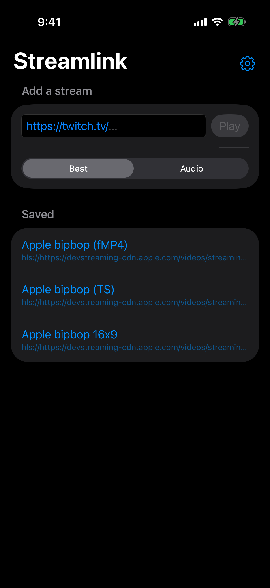
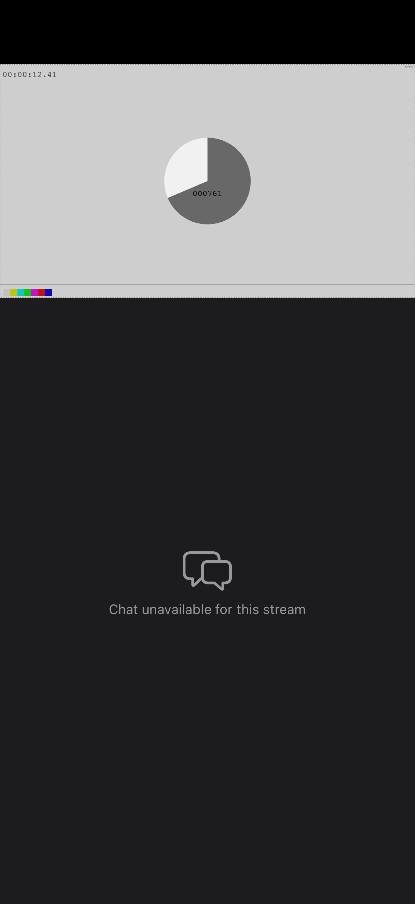
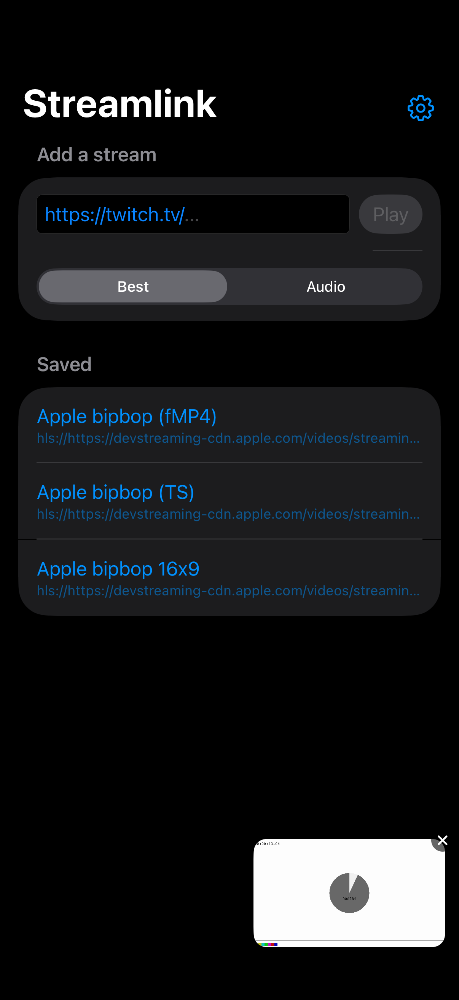
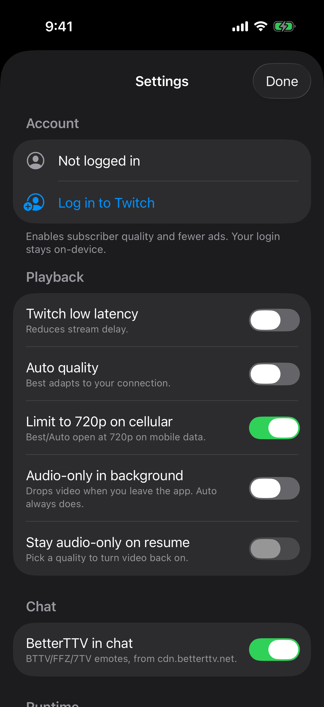
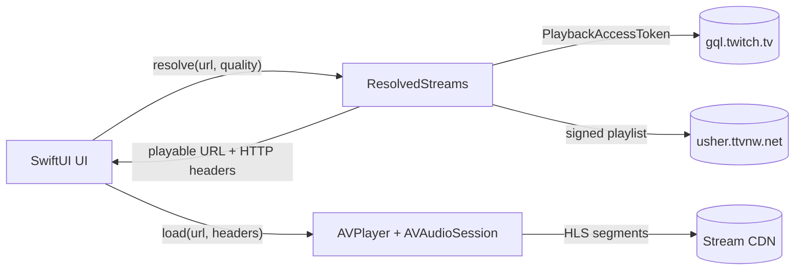

# Streamlink for iOS

A native iOS app that plays Twitch streams (and plain HLS URLs) through the native iOS
audio/video stack (`AVPlayer` + `AVAudioSession`) — with background audio and
Control Center / AirPlay for free.

It resolves streams itself, in Swift, the way [Streamlink](https://streamlink.github.io/)'s
Twitch plugin does: no embedded Python, no web wrapper.

| Streams | Player | Mini player | Settings |
| :---: | :---: | :---: | :---: |
|  |  |  |  |

## Features

- Twitch live channels, VODs and clips, plus direct HLS (`hls://…` or `.m3u8` URLs): saved
  streams list, Best / Audio-only / Auto (adaptive) quality, and a quality picker on the player.
- Full player with chat underneath, a draggable in-app mini player, and Picture in Picture.
- Background audio, with optional drop to audio-only when the app leaves the foreground.
- Lock screen / Control Center controls; Twitch streams show the stream title, game and
  channel picture.
- Twitch login (in-app, stays on-device) for subscriber quality and fewer ads, low-latency
  mode, and BetterTTV/FFZ/7TV emotes in chat.
- Caps Best/Auto at 720p on cellular (optional); auto-reconnects after drops.

## How it works



- `TwitchAPI` gets a playback access token from Twitch's GQL API (with the login cookie from the
  chat webview, if any), then the multivariant playlist from usher, signed with it. Clips are
  plain MP4s signed the same way.
- `ResolvedStreams` names the variants and picks `best` like Streamlink does; `auto` hands
  `AVPlayer` the multivariant playlist so it adapts on its own.
- Requests identify as Mobile Safari (WebKit's own user agent plus Safari's `Version/…
  Safari/604.1` tokens, which the chat webview uses too), with the web player's Origin/Referer,
  and AVPlayer gets the same headers for playlists and segments.

## Requirements

- macOS with **Xcode 16+** (built/tested against Xcode 26, iOS 26 SDK)
- [`xcodegen`](https://github.com/yonaskolb/XcodeGen): `brew install xcodegen`

## Build & run (simulator)

```bash
make project      # generate Streamlink.xcodeproj
make build        # build for the iOS Simulator
make run          # boot a simulator, install, launch
```

`make smoke` resolves a public HLS sample and asserts `AVPlayer` reaches the playing state — a
headless end-to-end check. Point it at Twitch with `make smoke SMOKE_URL=https://twitch.tv/<channel>`.

Pick a simulator with `SIM=`, e.g. `make run SIM="iPhone 17 Pro"`.

## Sideloading to a device

The project uses automatic signing with an **empty development team** so anyone can sign with
their own free Apple ID:

1. `make project` then open `Streamlink.xcodeproj` in Xcode.
2. Select the `Streamlink` target → Signing & Capabilities → choose your Team.
3. Build to your device, or archive and sign with AltStore / Sideloadly.

The only entitlement is background audio (`UIBackgroundModes: audio`) — no special provisioning
needed. Bundle id is `com.agartner.streamlink`; change it in `project.yml` if you like.

## Layout

```
project.yml            XcodeGen project spec
Makefile               build orchestration
scripts/run-sim.sh     boot / install / launch / smoke on the simulator
Sources/App/           SwiftUI app, stream resolution (TwitchAPI, StreamResolver), AVPlayer
UIDriver/              XCUITest-based UI driver (make ui-driver)
```

## Notes / limitations

- Only Twitch and direct HLS: the other sites Streamlink supports aren't.
- **DASH-only** streams are out of scope: `AVPlayer` has no native DASH.
- Picking one quality of a stream whose audio is a separate rendition (not Twitch's) plays that
  variant's video only; Auto keeps the audio.
