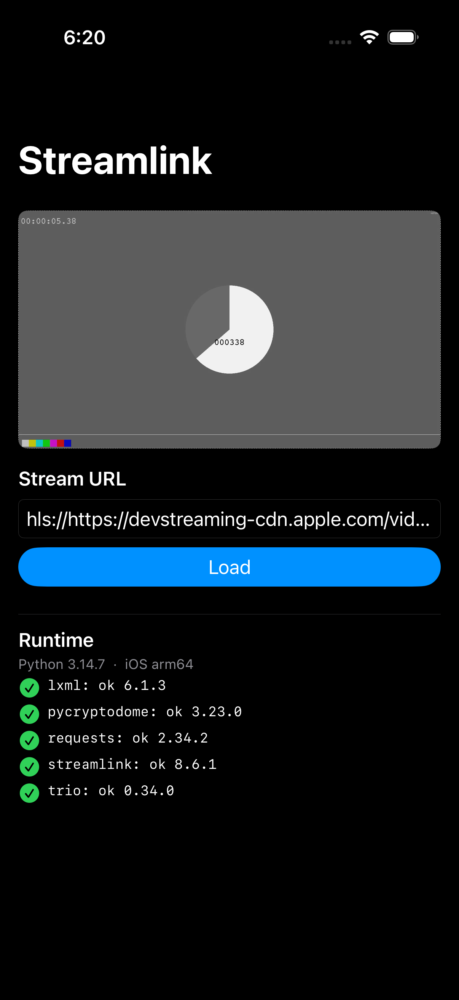

# Streamlink for iOS

A native iOS app that runs the **actual Python [Streamlink](https://streamlink.github.io/)
engine on-device** to resolve a stream from any supported service, then plays it through
the native iOS audio/video stack (`AVPlayer` + `AVAudioSession`) — with background audio and
Control Center / AirPlay for free.

This is **not** a web wrapper. It embeds CPython 3.14 (via
[Python-Apple-support](https://github.com/beeware/Python-Apple-support)) and the full
Streamlink package, including its two C-extension dependencies (`lxml`, `pycryptodome`)
cross-compiled for iOS.



## How it works

```
SwiftUI UI ──> PythonBridge (C API, JSON) ──> slbridge.py ──> Streamlink session
     │                                                              │
     │                                        resolves URL + headers (all plugins)
     ▼                                                              ▼
AVPlayer + AVAudioSession  <────────────  { "url": "...m3u8", "headers": {...} }
```

- **Streamlink only resolves** the stream (its plugins, auth, HLS/DASH logic). It hands back a
  playable URL, which `AVPlayer` decodes natively — so audio flows through CoreAudio with no
  bundled FFmpeg.
- The Swift ↔ Python boundary is a single `slbridge.handle(json) -> json` call over the CPython
  C API (`Sources/Bridge/PyBridge.m`), which is robust on iOS and avoids PythonKit's dlopen quirks.
- On iOS every compiled `.so` must live in a signed `.framework`. The `Python.xcframework`'s
  `build/utils.sh` does that conversion at build time (a Run Script phase); pycryptodome loads its
  libs via `ctypes`, so `slbridge` monkeypatches its loader to follow the `.fwork` markers.

## Requirements

- macOS with **Xcode 16+** (built/tested against Xcode 26, iOS 26 SDK)
- [`uv`](https://github.com/astral-sh/uv), [`xcodegen`](https://github.com/yonaskolb/XcodeGen), `curl`
  ```
  brew install uv xcodegen
  ```

## Build & run (simulator)

```bash
make bootstrap    # fetch the Python runtime + assemble on-device packages
make project      # generate Streamlink.xcodeproj
make build        # build for the iOS Simulator
make run          # boot a simulator, install, launch
```

`make smoke` resolves a public HLS sample through Streamlink and asserts `AVPlayer` reaches the
playing state — a headless end-to-end check.

Pick a simulator with `SIM=`, e.g. `make run SIM="iPhone 17 Pro"`.

## The iOS wheels (`lxml`, `pycryptodome`)

Neither has an iOS wheel on PyPI, so they are cross-compiled once (including a static
libxml2 + libxslt for `lxml`) and **hosted**, not committed:

```bash
make wheels       # cross-compile all 4 wheels -> vendor/wheels/ (+ manifest.txt, SHA256SUMS.txt)
```

`make wheels` must run **outside a command sandbox** (autotools `./configure` mutates `PATH`).
It produces device + simulator arm64 wheels for both packages.

`make bootstrap` obtains the wheels in this priority:

1. a local `vendor/wheels/*.whl` (what `make wheels` writes), else
2. downloaded from `WHEELS_URL` (default: this repo's GitHub Release `wheels-3.14`; point it at an
   S3 bucket or any URL instead):
   ```bash
   WHEELS_URL="https://my-bucket.s3.amazonaws.com/streamlink-ios/wheels-3.14" make bootstrap
   ```

To publish the wheels you built: upload `vendor/wheels/*.whl` (and `manifest.txt`) to that location.

## Sideloading to a device

The project uses automatic signing with an **empty development team** so anyone can sign with
their own free Apple ID:

1. `make project` then open `Streamlink.xcodeproj` in Xcode.
2. Select the `Streamlink` target → Signing & Capabilities → choose your Team.
3. Build to your device, or archive and sign with AltStore / Sideloadly.

The only entitlement is background audio (`UIBackgroundModes: audio`) — no special provisioning
needed. Bundle id is `com.example.streamlink`; change it in `project.yml` if you like.

## Layout

```
project.yml            XcodeGen project spec
Makefile               build orchestration
scripts/
  build-wheels.sh      cross-compile lxml + pycryptodome (libxml2/libxslt) for iOS
  bootstrap.sh         fetch Python runtime, assemble app_packages + native/<slice>
  run-sim.sh           boot / install / launch / smoke on the simulator
Sources/App/           SwiftUI app, AVPlayer, AVAudioSession, Python bridge wrapper
Sources/Bridge/        CPython C-API bridge (Objective-C)
app/slbridge.py        Python entry point called from Swift
vendor/wheels/         iOS wheels (produced by make wheels; hosted, gitignored)
```

## Notes / limitations

- **DASH-only** streams are out of scope: `AVPlayer` has no native DASH. HLS and progressive
  streams (the large majority of Streamlink sources) play natively.
- Streamlink is installed without the optional `[decompress]` (brotli/zstd) extra.
- Pinned versions: Python 3.14 (Python-Apple-support `3.14-b11`), Streamlink 8.6.1,
  lxml 6.1.3, pycryptodome 3.23.0, libxml2 2.13.8, libxslt 1.1.43. Override via env
  (see `scripts/build-wheels.sh`).
